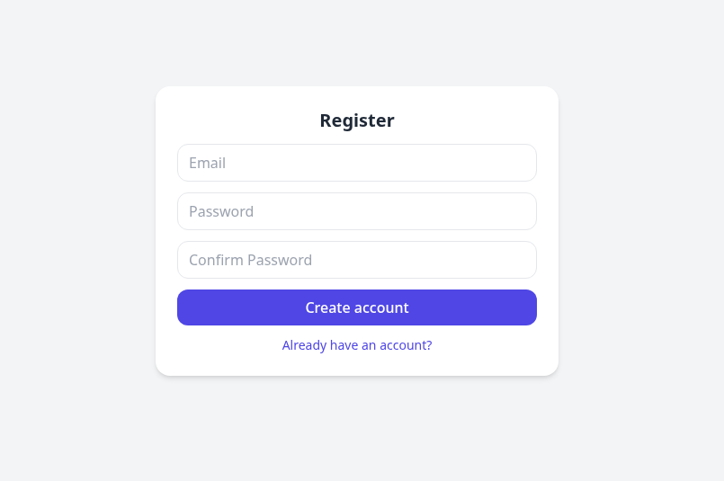
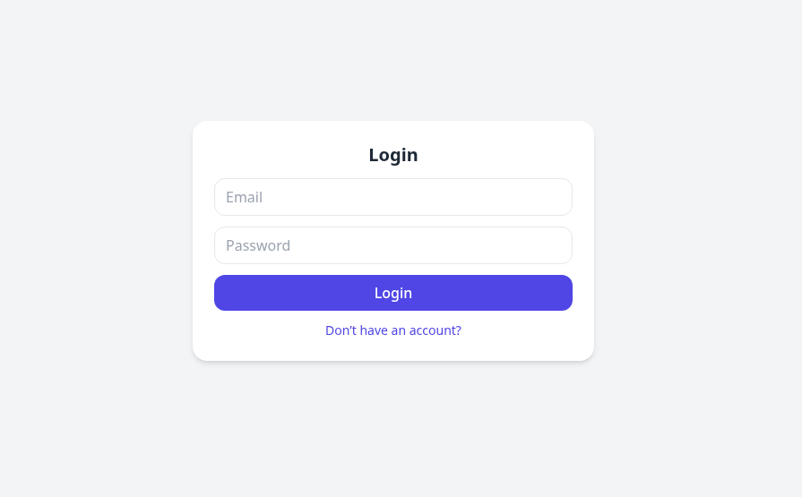
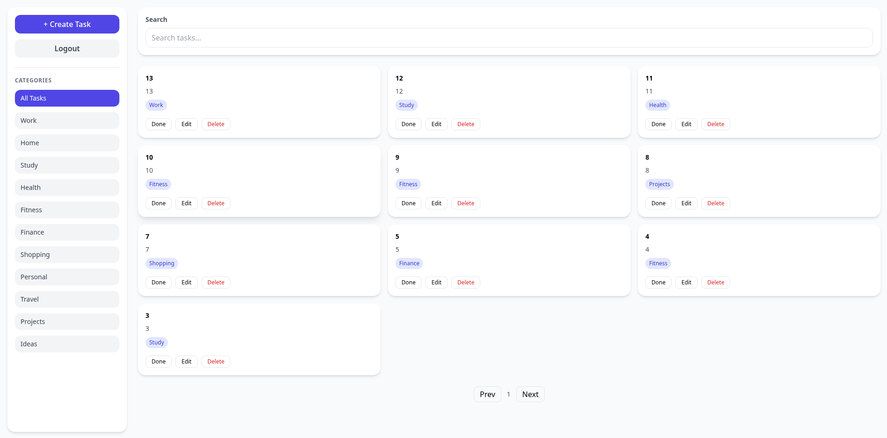
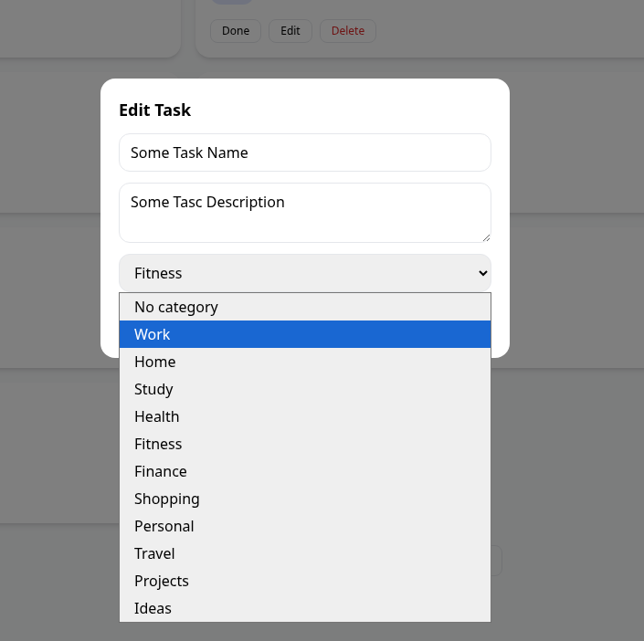

# ToDo Application (Angular + .NET)

Full-stack ToDo app built with ASP.NET Core + Angular.

---

## Tech Stack

### Backend

* ASP.NET Core Web API (.NET 8)
* Entity Framework Core
* MS SQL Server
* JWT Authentication
* FluentValidation
* Clean layered architecture (Controller → Service → Repository → Data)

### Frontend

* Angular (Standalone Components)
* Tailwind CSS
* RxJS (debounce search, state handling)
* HTTP Interceptors (JWT auth)
* Auth Guard (protected routes)

---

## Features

### Authentication

* Register / Login
* JWT token stored in localStorage
* Protected routes

### Tasks

* Create / Update / Delete tasks
* Mark tasks as completed
* Pagination
* Search (debounced)
* Filter by category

### Categories

* Pre-seeded categories
* Filter tasks by category

---

## Architecture (Backend)

```
Controllers → Services → Repositories → Data (EF Core)
```

---

## Requirements

* .NET 8 SDK
* Node.js 18+
* Angular CLI
* SQL Server

---

## Backend Setup

### 1. Configure Database

Edit `appsettings.json`:

```json
{
  "ConnectionStrings": {
    "DefaultConnection": "Server=localhost;Database=TodoDb;Trusted_Connection=True;TrustServerCertificate=True;"
  }
}
```

### 2. Apply Migrations

```bash
cd ToDoBackEnd
dotnet ef database update
```

### 3. Run Backend

```bash
dotnet run
```
Backend runs on:
* http://localhost:5261/api
  
Swagger:

* http://localhost:5261/swagger

---

## Frontend Setup

### 1. Install Dependencies

```bash
cd ToDoFrontEnd
npm install
```

### 2. Run Angular

```bash
ng serve
```

Frontend runs on:

* http://localhost:4200

---

## Authentication Flow

* JWT token stored in localStorage
* HTTP interceptor automatically adds Authorization header
* AuthGuard protects authenticated routes

---

## API Endpoints

### Auth

```http
POST /api/auth/register
POST /api/auth/login
```

### Tasks

```http
GET    /api/tasks
POST   /api/tasks
PUT    /api/tasks/{id}
DELETE /api/tasks/{id}
PATCH  /api/tasks/{id}/status
```

### Categories

```http
GET /api/categories
```

---

## Notes

* Seeder automatically creates categories
* Tasks are user-specific
* UI updates without page refresh
* Backend handles pagination and filtering
* JWT-based authentication and authorization

---

## Author

Test project for demonstrating full-stack development skills using ASP.NET Core and Angular.

## Screenshots

### Register



### Login



### Tasks



### Edit




